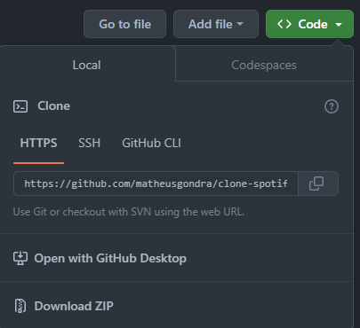

# Clone Spotify

Um clone da página do Spotify feito com [Tailwind CSS](https://tailwindcss.com/)

| :placard: Vitrine.Dev |     |
| -------------  | --- |
| :sparkles: Nome        | **Dev Soutinho Labs**
| :label: Tecnologias | HMTL, CSS, TailwindCSS
| :rocket: URL         | [Clone Spotify](https://clone-spotify-p6nrla0sl-matheusgondra.vercel.app/)

<div style="margin: 1rem 0">
	
	
	
</div>


## Como Usar

1. Baixe o repositório para a sua máquina como **ZIP** cliando no botão **Code** e depois **Download ZIP**



Ou usando o comando:

```bash
git clone https://github.com/matheusgondra/clone-spotify.git
```

2. Abra o terminal e instale as dependências com o comando:

```bash
npm install
```

ou

```bash
yarn install
```

3. Rode o comando `npm run build` ou `yarn build` para o tailwind compilar o CSS.

4. Abra o arquivo `index.html` dentro da pasta `src`